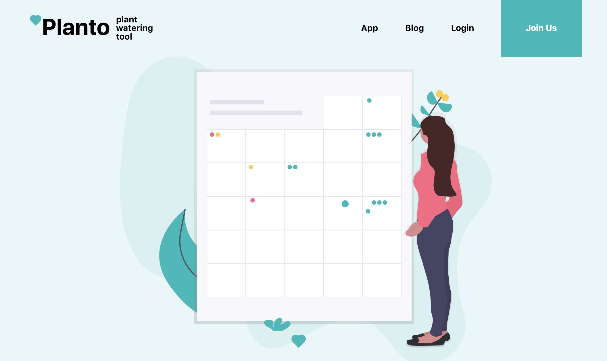
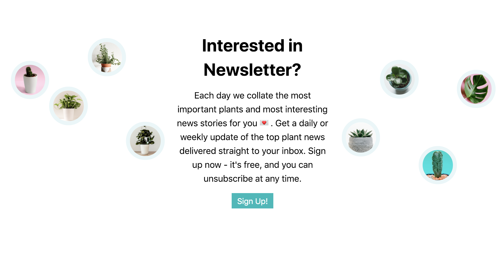
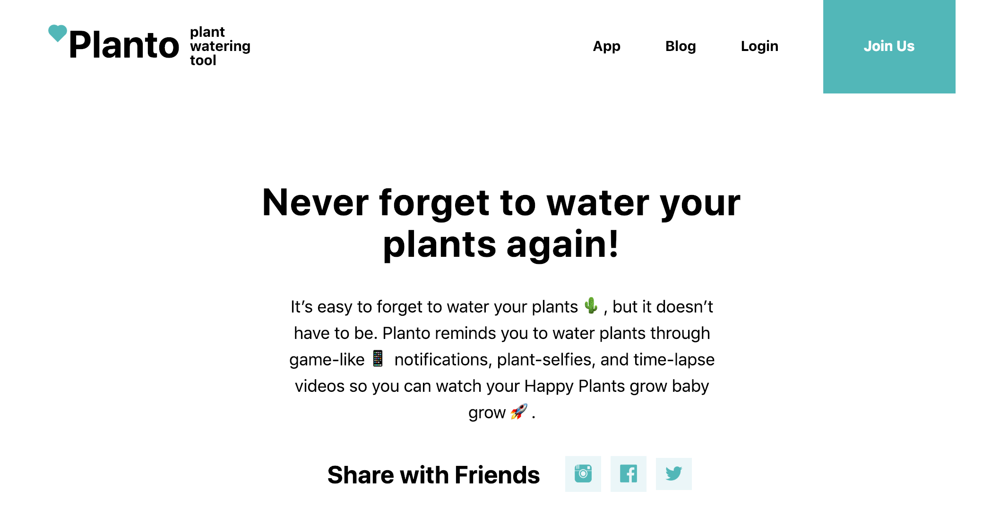

# Planto - The Plant Watering App 🌵

Welcome! 👋 This repository contains the source code and content for a marketing webpage for fictional company Planto 🌿: the home page and blog page. This webpage was created as a part of the Lambda's Project Week: User Interface. Website was created from scratch and was inspired by a beautiful 💜 web page of Acts Of Random Kideness (https://ark.cregital.com/). The main goal was to demonstrate the ablility to combine HTML, CSS, JavaScript, Libraries, and Programming Paradigms into one project.

Website is live and running on https://planto-the-plant-watering-app.herokuapp.com/.

You can check my trello board for this project here: https://trello.com/b/KNA46lWV/planto/.

## Used Technology and Tools

- CSS (flexbox, box model, positioning, animations, responsivness)
- LESS (mixins, variables)
- HTML (semantic html)
- Javascript (DOM, components, functions, objects, array and array methods)
- Greensock (animations)
- SVG animations
- Node.js + Express + Heroku (deployment)

## Check out some parts of the website

### 🌵 Jumbotron 🌵

### 🌿 Introduction 🌿

### 🌱 Newsletter section 🌱

